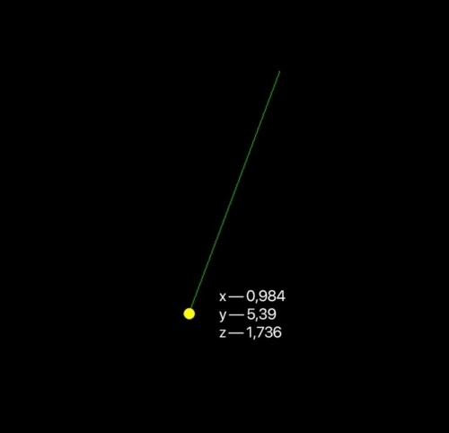
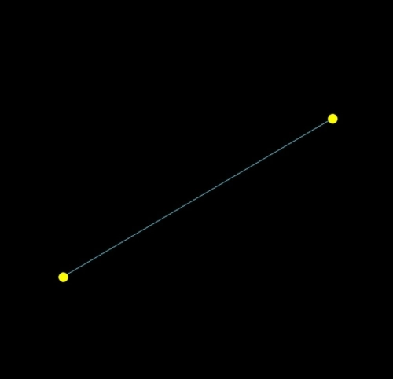
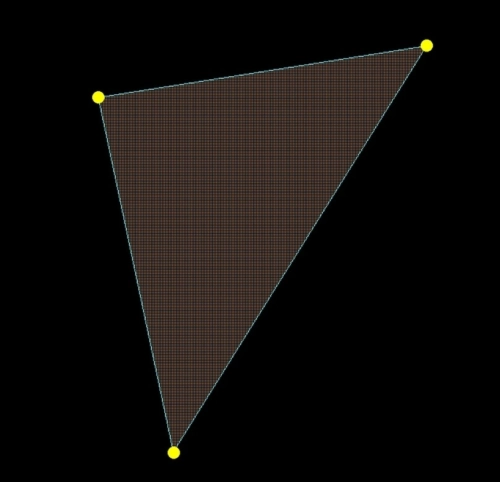
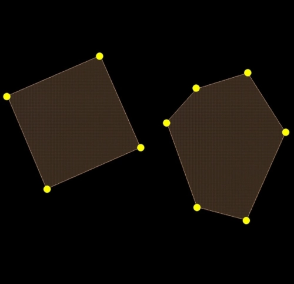
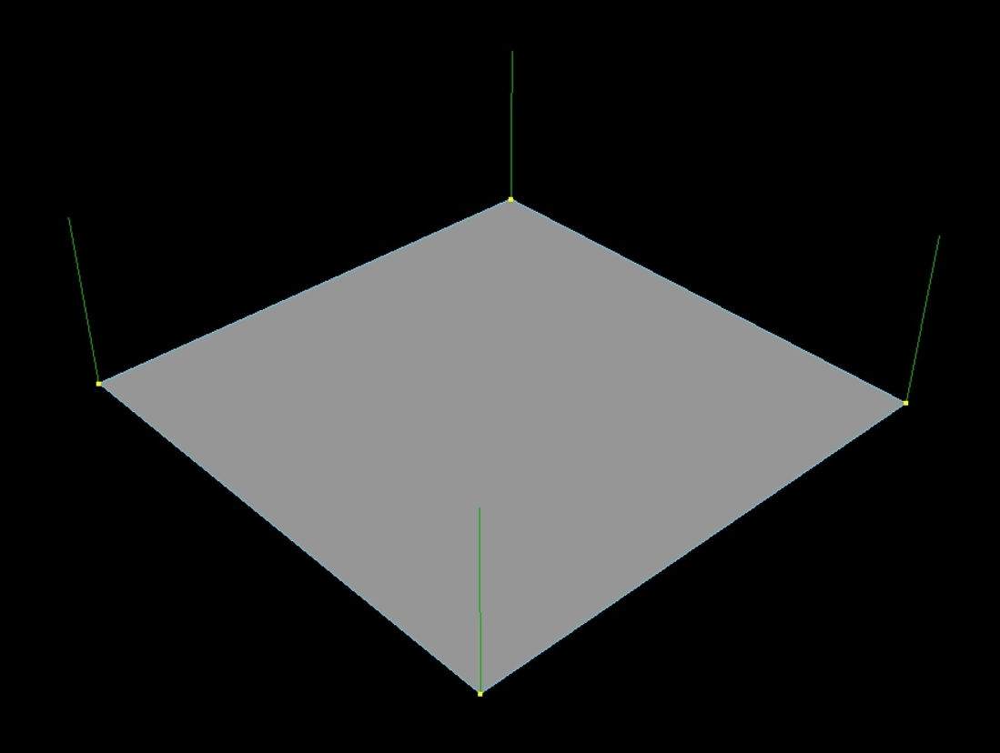
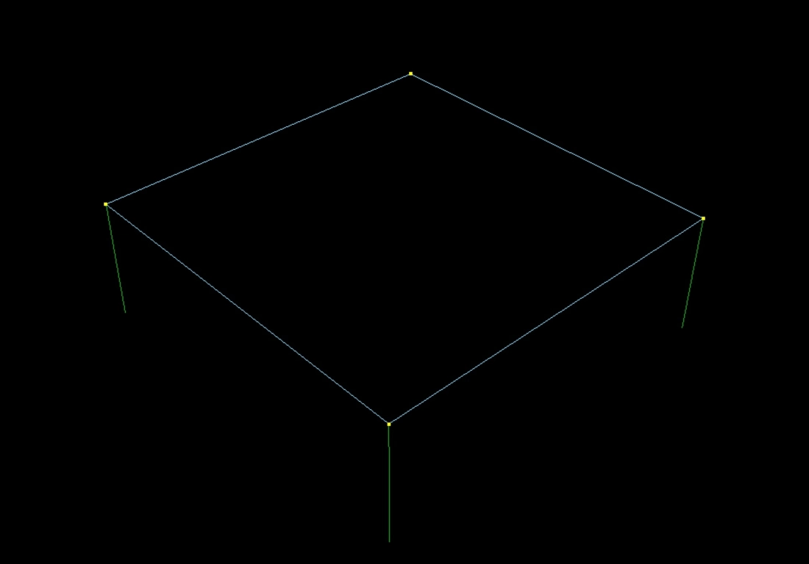
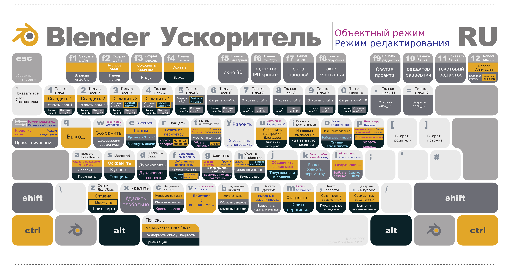

# blender

`Blender` является одним из самых популярных и мощных программных инструментов для 3D-моделирования и анимации. Сочетая в себе богатый функционал и бесплатную лицензию с открытым исходным кодом.

## Полигоны

Полигоны являются основными элементами трехмерной графики. В программе Blender они играют ключевую роль при создании и моделировании 3D-моделей. Полигоны представляют собой плоские многоугольники, состоящие из трех или более точек, называемых вершинами.

Концепция полигонов в Blender является важной, так как именно с их помощью можно создать разнообразные формы и структуры 3D-моделей. За счет соединения и комбинирования полигонов можно создавать сложные объекты и детализировать модели.

Один из важных аспектов полигонов в Blender — это топология. Топология определяет, как полигоны соединены между собой и каким образом они образуют поверхность модели. Корректная топология позволяет модели выглядеть более реалистично и сохранять свою форму при анимации и деформации.

При работе с полигонами в Blender существует несколько важных понятий:

- **Вершины (verticles)** : это точки в пространстве, которые определяют концы ребер полигона.

- **Ребра(edges)** : это отрезки, соединяющие вершины и определяющие видимые грани полигона.

- **Грани** : это лицевые стороны полигона, определяющие, какой цвет или текстура отображается на поверхности.

### Вершины

у каждой точки (вертекса) есть 2 параметра:

- Её положение в пространстве (по осям x, y, z)
- Её направленность. Эта характеристика называется «`вертекс нормаль`».

Так вот, направление `вертекс нормалей` напрямую влияют на поведение света на поверхности твоей модели.

## Рёбра

Две точки образуют `ребро`. Это всегда прямая линия. И у каждой точки есть своя вертекс нормаль.

## Полигоны

3 точки создают треугольник. Как ты помнишь из школьной геометрии, 3 точки создают плоскость.

При желании, ты можешь создать полигон из любого количества точек.

ты не должен забывать, что под капотом всех игровых движков и программ для 3D моделирования лежит одна особенность — в них **всё состоит из треугольников**.

Все программы и игровые движки научились триангулировать `полигоны`(т.е. превращать их в треугольники), состоящие из 4 и более точек. У разных программ свои алгоритмы триангуляции, и поэтому одна и та же модель в разных программах может выглядеть немного по-разному.

**Поэтому одна из задач создания игровой сетки — триангуляция. Мы переводим всё в треугольники руками**

## Несколько особенностей игрового света

1. `Вертекс` нормали влияют на видимость полигона

если `нормаль` направлена в твою сторону, то ты видишь полигон.

Но есть одна особенностей игровых движков. Если `вертекс нормаль` направлена ОТ камеры, то полигон становится полностью прозрачным, невидимым.

2. `Вертекс нормали` влияют на блик каждого полигона

3. `Вертекс нормали` влияют на жесткость граней

# Есть три вида сетки: лоу-, мид- и хайполи

- LowPoly — упрощённая и оптимизированная модель для игры с минимальным количеством полигонов.

- HighPoly — максимально детализированная модель, которая нужна, чтобы перенести всю детализацию на LowPoly через Normal Map

- MidPoly — компромис между бесконечно детализированными хайполи и оптимизированными лоуполи. Используется в основном для кино.

## Low Poly

- На лоуполи важны только полигоны, которые влияют на силуэт и строят формы.

- Элементы, которые не видишь — их надо удалять

- Всё, что слишком угловато на силуете — скругляй. Иногда для этого надо добавить новую геометрию.

- Все плоские детали, не влияющие на силуэт, рисуются через текстуры или на нормале.

## High Poly

Хайполи — это детализированная модель без ограничения по полигонам. На такой модели могут быть сделаны все, даже самые маленькие детали. Такие модели часто делают концептеры, а в видеоиграх такая геометрия нужна для запечки нормала.

Запомни: на хайполи можно всё.

Хайполи не ограничено количеством полигонов. Главное ограничение — чтобы файл открылся у тебя на компе.

## Mid Poly

Мидполи — компромис между бесконечно детализированными хайполи и оптимизированными лоуполи. С этой сеткой делают супер детальные и интересные модели, которые клёво смотрятся в кадре, хорошо шейдят, но в то же время они достаточно оптимизированные и легкие, для удобства текстурирования и работы с ними.

# Shortcuts

## Работа с видом

- Вид с камеры: ***0***
- Вид сбоку: ***3/ctrl-3***
- Вид сверху/снизу: ***7/ctrl-7***
- Вид спереди/сзади: ***1/ctrl-1***
- Выбор вида с помощью кольца: ***ё***
- Осмотр объектов: ***зажать колёсико мыши***
- Перемещение вида в любое удобное положение: ***shift+колёсико мыши***
- Показать все объекты: ***home***
- Полноэкранный режим (с панелями инструментов) вкл/выкл: ***ctrl-space***
- Полноэкранный режим вкл/выкл: ***ctrl-alt-space***

## Смена режима

- Просмотр объекта/редактирование объекта: ***tab***
- Рентген вкл/выкл: ***alt-Z***

## Взаимодействие и редактирование объекта

- Вращение: ***R***
- Выделение объекта: ***A***
- Снять выделение ***alt-A***
- Инвертировать выделение: ***ctrl-A***
- Масштабирование: ***S***
- Выдавить: ***E***, отмена действия: ***ctrl-z***
- Перемещение: ***G***
- Скрыть объект или точку: ***H***
- Показать всё скрытое ***alt-H***
- Объединить точки: ***M***
- Добавить точки внутрь квадрата и тд: ***I***
- Нож: ***K***
- Открыть меню вершины: ***ctrl-V***
- Открыть меню ребра: ***ctrl-E***
- Открыть меню грани: ***ctrl-F***
- Удаление: ***X***
- Пересчитать нормали: ***shift-N***
- Создать связи: ***F***
- Скос: ***ctrl-B***

