# Работа с референсами

Полюби работу с референсами, они ключ к выразительности и пониманию модели.

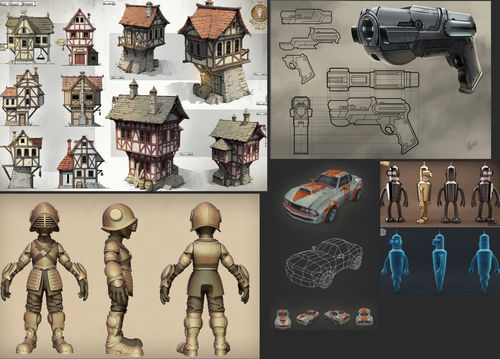

> Качество работы = скилл х референсы. Если референсов 0 — хорошей работы не сделать.

## Зачем концепт-художнику референсы

**Референс** — вспомогательное изображение, которое художник использует для проработки визуального объекта. Например, персонажа, строения или локации. Референсом может быть фотография, картинка, рендер для анализа светотени, сборник поз и ракурсов и даже палитра цветов.

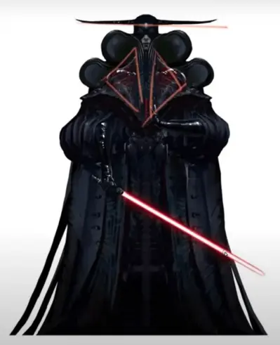

Перед тем, как приступить к отбору референсов, художнику нужно определить факторы, которые лягут в основу создаваемого объекта. Уже на этом этапе формируется базовое представление о будущем концепте.

Например, вам надо создать персонажа. Для этого можно ориентироваться на механики его взаимодействия с миром, класс и принадлежность к касте.

#### есть два направления работы с рефами:

- поиск и объединение подходящих моделей
- раскрытие образа через логику персонажа

## Где применяют референсы?

Референсы используют для любой работы — но в первую очередь они нужны там, где должен быть визуальный результат.

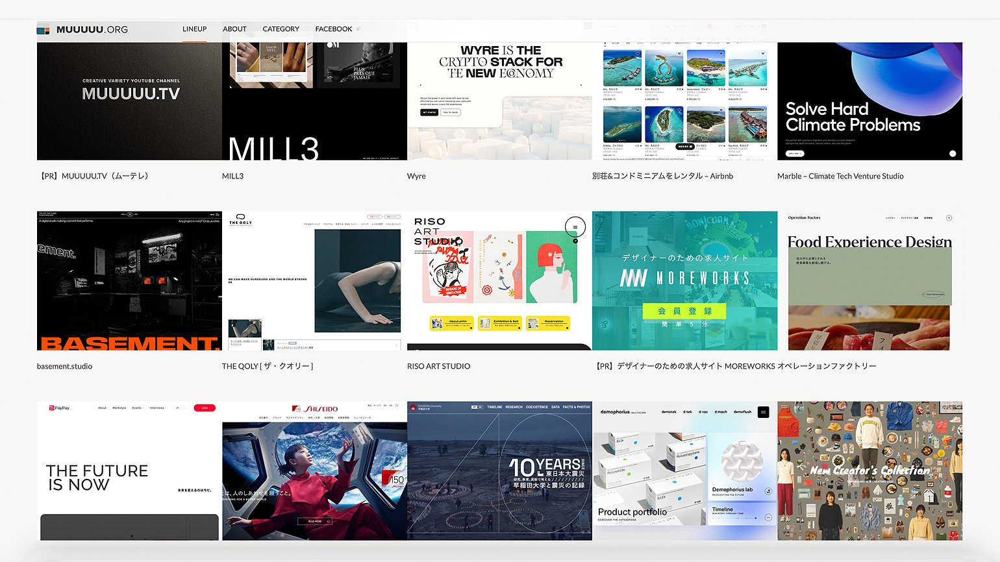

1. В концепт-арте референсы — это основа: к ним обращаются 2D- и 3D-художники, когда им необходимо изобразить нечто сказочное, несуществующее и при этом характерное.
2. В архитектуре и дизайне интерьера с помощью референсов определяют вектор работы над будущим зданием или помещением, подбирают стиль.
3. В веб-дизайне и программировании референсы помогают найти не только подходящую эстетику, но и удобные решения для пользователей сайта или приложения.
4. В брендинге и маркетинговом дизайне референсы помогают визуально отстроиться от конкурентов или, наоборот, сделать очень похожий логотип или паттерн.

В какой-то момент референсы становятся чисто техническим инструментом. Они не определяют ваш концепт, а лишь помогают разобраться в деталях — как крепится доспех, где удобнее повесить кинжал и так далее.

### Референсы группируют как правило по этим категориям:

- **Концепт** — рисунок о том, как выглядит модель. Это ее общий вид, который утвердил арт директор и гейм дизайнер (режиссер в кино)
  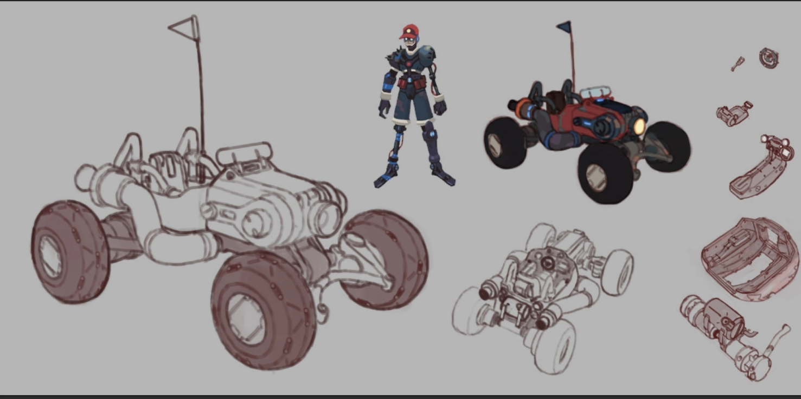

- **Фотографии** — чтобы лучше понять силуэт и составляющие модели. Работа художника — это всегда подражание реальному миру
  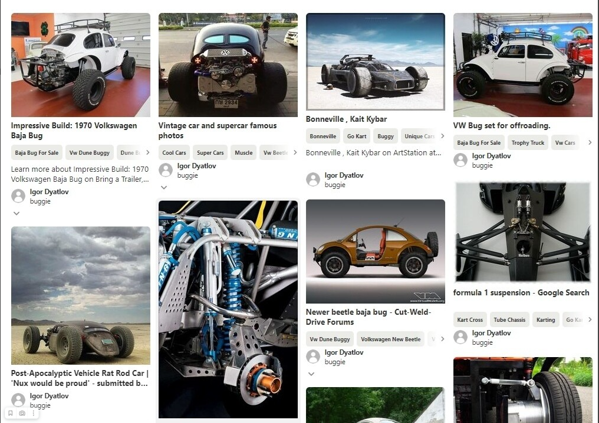

- **Детали** — чтобы лучше понимать как функционирует объект и как детали крепятся друг другу, нужно искать референсы детализации. Часто это референсы с самых разных объектов.
  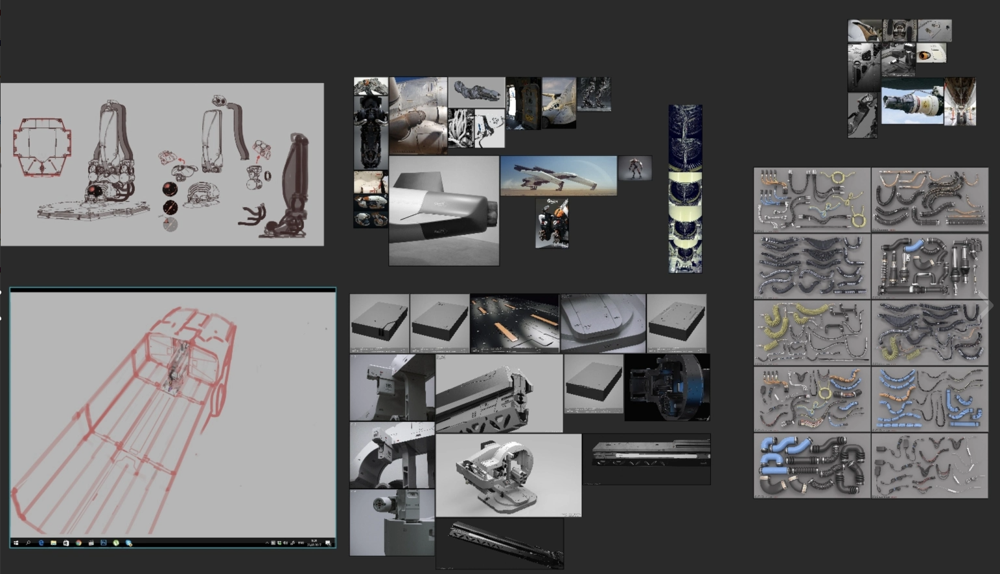

- **Работы других художников** — скорее всего ты не первый, кто моделит эту вещь. А её не только моделили до тебя, но и рисовали в 2D и снимали в кино
  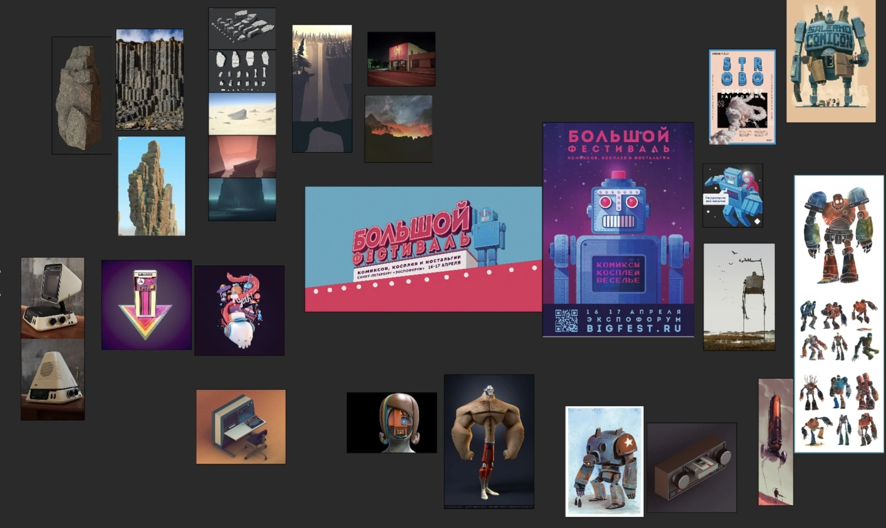

- **Материалы**, **текстуры** — важно найти хорошие фотографии и арты с клёвыми текстурами и фактурами. Из головы хороший материал не сделать, поэтому очень важно запасаться рефами текстурок.
  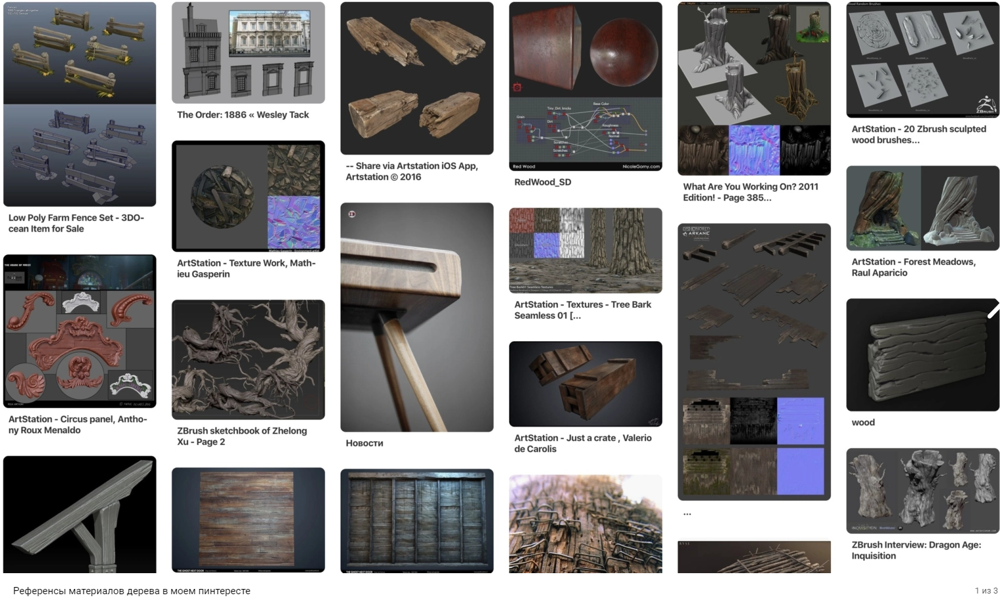

- **Повреждения**, **потёртости** и прочее — у разных объектов они сильно отличаются. Из «50 оттенков ржавчины», которые можно найти на улицах нашей страны, для проекта тебе нужно выбрать 2-3, которые ты будешь использовать.
  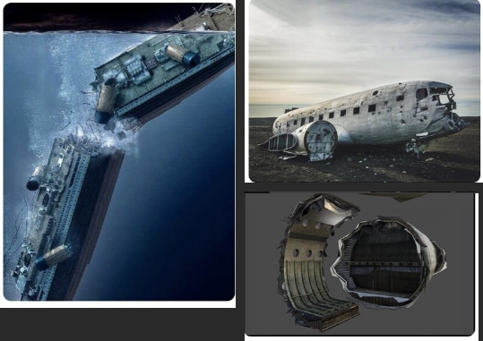

## Дизайн через комбинирование

В этом случае художник исходит из готовых образов: вычленяет и комбинирует отдельные элементы костюма

Самый простой вариант такой работы — коллаж. Художник выбирает отдельные элементы из ряда референсных картинок и объединяет их в новый концепт.
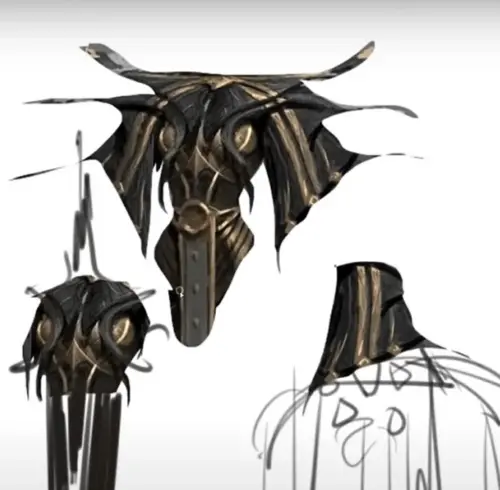

## Дизайн через раскрытие образа

При работе через логику персонажа художник уделяет больше времени процессу подготовки и скетчинга. Сеттинг, механики и задачи геймдизайнеров формируют тезисы

Например, художник знает, что персонаж быстрый и ловкий. Тогда, скорее всего, меч он должен выхватывать из-за спины, так как оружие в руках будет ограничивать его мобильность вне боя.
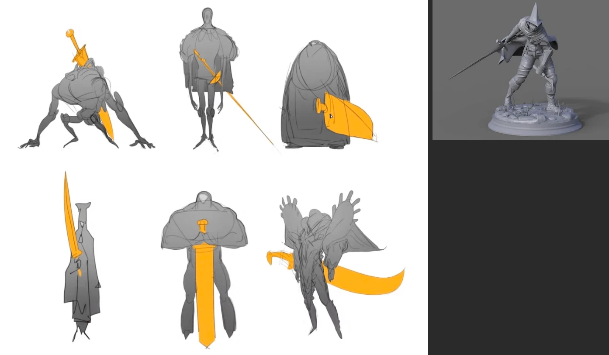

> Работа с референсами — больше, чем просто перерисовка картинок из Pinterest. Это творческий процесс. Главное – не упирать в жёсткий копипаст и составление Франкенштейна.
