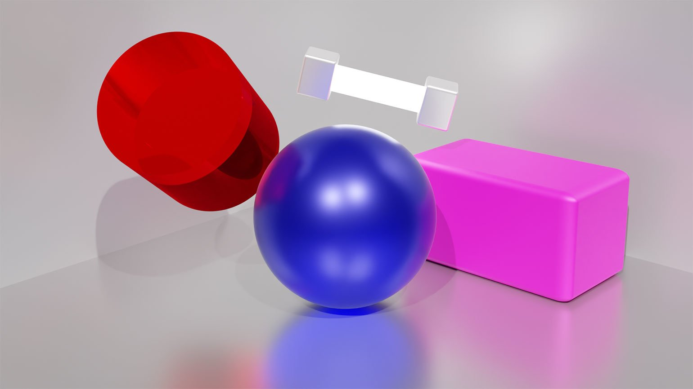
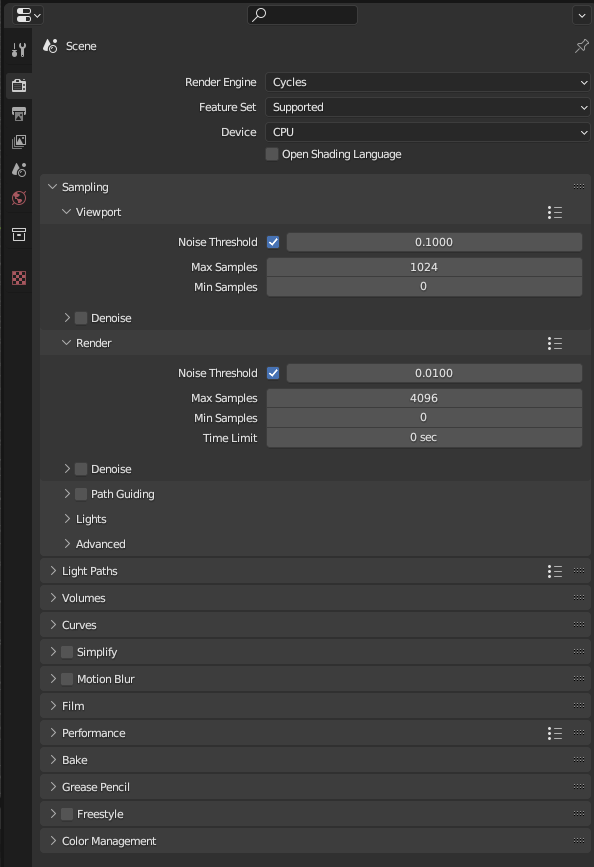
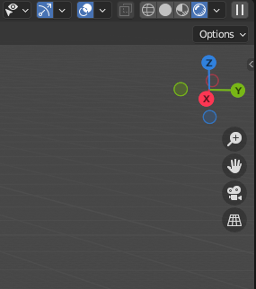
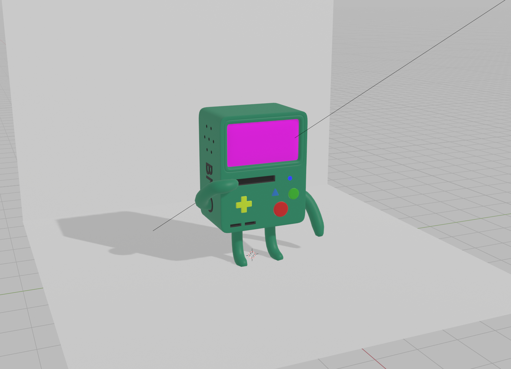
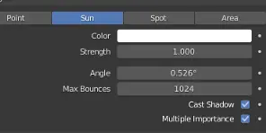
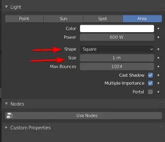

## Движок Cycles

Чаще всего в работе используют Cycles, так как он считает физически корректное освещение «из коробки».

Но так как Cycles производит много вычислений, он может выводить картинку и 10, и 20 минут. Также вы можете столкнуться с проблемой шума — когда на изображении появляется лишняя зернистость.

### Настройка cycles рендера

Настройте параметры устройств. Перейдите в **Edit** → **Preference** → **System**.

В блоке **Cycles Render Device** кликните **CUDA** и поставьте галочку напротив названия вашей видеокарты.

Также можно отметить и процессор, но обычно из-за этого время рендера увеличивается.

**Render Engine** — вместо **Eevee** укажите **Cycles**.

**Device** — вместо CPU укажите GPU Compute(если есть графическое ядро), чтобы движок использовал видеокарту, а не процессор.

Sampling:

- Viewport (в окне программы):
- Noise Threshold — от 0,1.
- Max Samples — от 10 до 50.
- Denoise — укажите галочку.

Render (на рендере):

- Noise Thrashold — от 0,1 до 0,0001.
- Max Samples — от 128 до 1024.
- Denoise — укажите галочку.

Также не забудьте включить режим отображение рендера, иначе ничего не будет видно

## Что это за семплы и денойзы?

**Семпл(Samples)** — итерация вычисления для движка. Чем больше семплов, тем лучше качество на выходе и дольше время рендеринга. Если указать низкое количество семплов, то картинка будет очень шумной

**Noise Threshold** — указывает порог «ошибки» шума при рендере. Например, если на двух разных семплах разное количество шума, движок будет решать, пересчитывать ли ему текущий семпл или нет.

Чем ниже это значение, тем меньше будет разница шум

**Denoise** — снижает уровень шума на картинке. Но если вы укажете мало семплов, то на выходе получите очень много артефактов.

Film:

- **Transparent** — поставьте галочку, если хотите вывести изображение с прозрачным фоном.

**Color Management** — Настройка цветового пространства и цветокоррекция.Если вы работали в Photoshop, то сразу разберётесь с этой вкладкой.

## Движок Eevee

В отличие от **Cycles**, **Eevee** не пытается сделать освещение физически корректным. Благодаря этому движок может выводить изображения очень быстро и без лишних шумов.Но он очень плохо справляется с бликами, тенями, отражениями — их нужно настраивать отдельно под каждую работу.

## Освещение

Освещение – достаточно важная тема в визуализации, наряду с моделированием, созданием материалов и текстур.

Прекрасно смоделированные и затекстурированные сцены без соответствующего освещения будут выглядеть очень неважно, в то время как самая простая модель может быть очень реалистичной при правильном освещении.

В Blender’е вы можете управлять следующими элементами, которые влияют на освещение:

- Цвет рассеянного освещения окружающей среды.
- Степень, с которой окружающее освещение окрашивает материал объекта.
- Отражённое освещение, когда цвет одного объекта передаётся другому.
- Лампы в сцене.

## Настройки освещения

Здесь вы можете влиять на:

- Цвет источника света;
- Позицию источника света и его направление;
- Настройки источника света, включая его энергию и затухание.

А также тип источника света, всего их 4 вида:

- Point — свет этого источника распространяется из одной точки равномерно во все стороны, с постепенным затуханием.
- Sun — источник направленного света с параллельными лучами, без затухания.
- Spot — источник , излучающий свет из одной точки, но область свечения ограничена направленным конусом, который мы можем настраивать
  

- Area — источник света, при использовании которого излучение происходит из плоскости, форму и размер которой мы можем настраивать.
  

[Настройка света](https://dtf.ru/gamedev/174085-nastroyka-sveta-v-blender) достаточно информативная и интересная статья про свет. Рекомедую почитать.

## Советы для лучшего освещения в блендере

1. Не переусердствуйте

   Попытка осветить все в сцене является одной из самых распространенных ошибок среди новичков.

   Переосвещение сцены устраняет тени, которые играют важную роль. Без этих теней модель выглядит плоской.

2. Подчеркните основной объект

   Освещение играет важную роль в сосредоточении внимания зрителя. Если все освещено одинаково, то значит ничего не важно.

   Поэтому следите за тем, чтобы важные объекты в сцене получали больше света, чем второстепенные.
