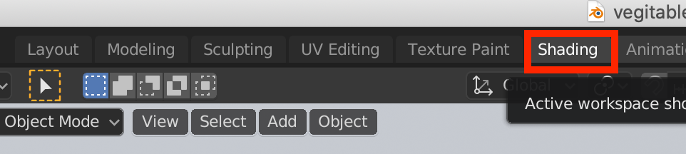
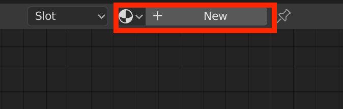
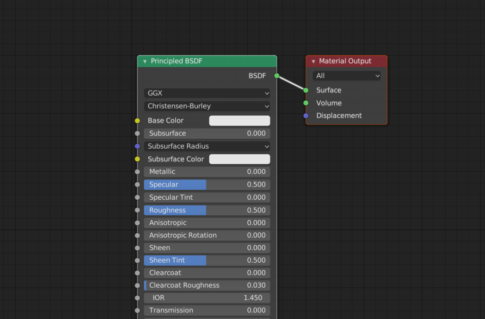
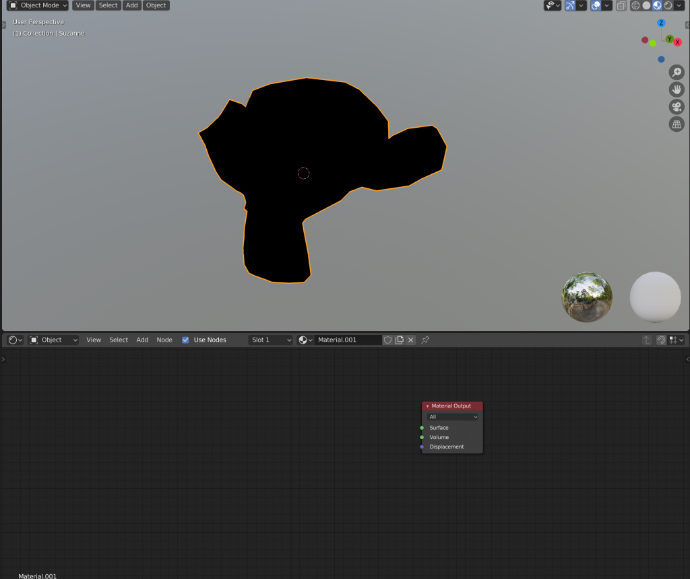
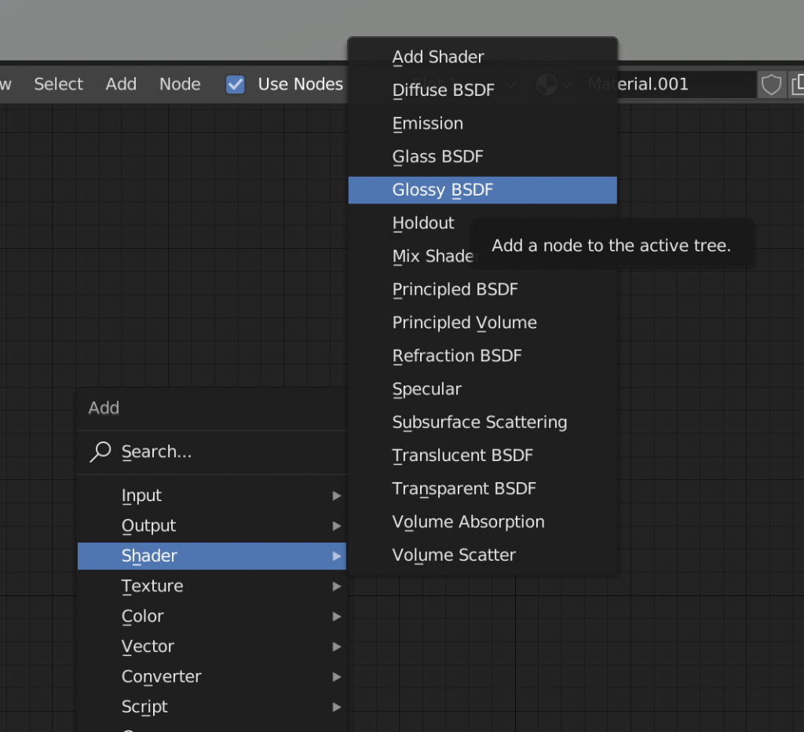
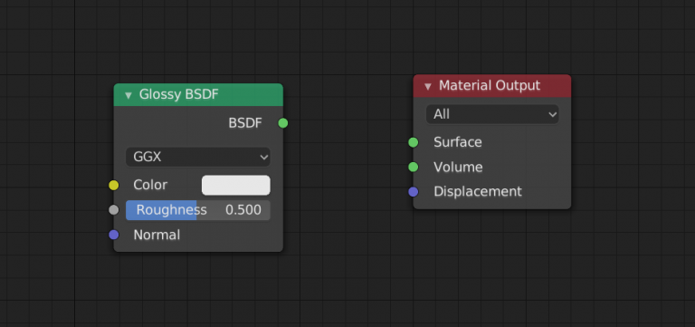
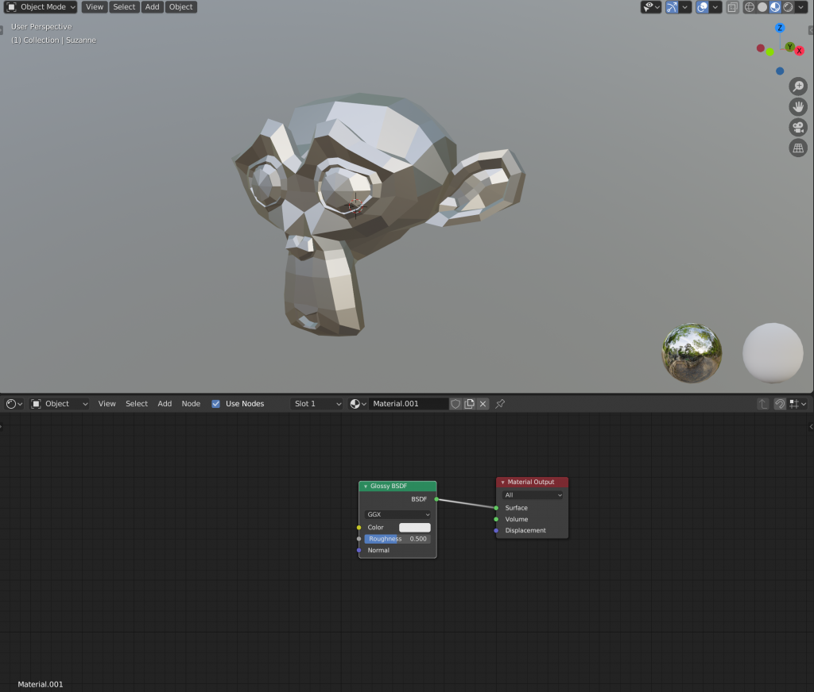
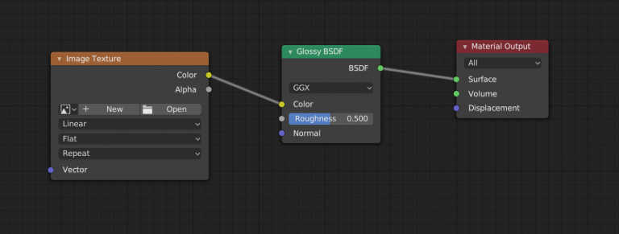

## Shader editor
Редактор шейдеров используется для редактирования материалов, которые используются для рендеринга. Материалы, используемые Cycles и Eevee, определяются с помощью дерева узлов. Следовательно, главное окно редактора шейдеров - это редактор узлов.

Blender предлагает широкий спектр шейдеров. Основные виды шейдеров в Blender включают:

- **Diffuse Shader**: Этот шейдер отвечает за базовое покрытие объекта и контролирует яркость и цвет покрытия. Он представляет обычное, не отражающее свет покрытие.

- **Glossy Shader**: Глянцевый шейдер позволяет создавать отражающую поверхность, обладающую гладким и блестящим эффектом. Он контролирует отражение света в зависимости от угла падения.

- **Transparent Shader**: Транспарентный шейдер создает прозрачные объекты, позволяя пропускать свет через них или делать их полупрозрачными. Этот тип шейдера очень полезен при создании стекла или воды.

- **Emission Shader**: Это шейдер, который позволяет объекту испускать свет, таким образом, что он сам становится источником света. Он используется, когда нужно создать подсветку или собственное излучение от объекта.

- **Subsurface Scattering** Shader: Шейдер позволяет объекту вести себя подобно полупрозрачной материи, такой как кожа или молоко, пропуская свет через себя и создавая переосвещение. Он позволяет создавать мягкий и натуральный эффект освещения объекта.

- **Volume Shader**: Волюметрический шейдер используется для создания объектов с объемом, таких как дым, туман или облака. Он позволяет контролировать проницаемость и распределение света внутри таких объектов.

Это лишь некоторые из основных видов шейдеров в Blender. Использование различных комбинаций шейдеров позволяет достичь разнообразных эффектов и создать реалистичные визуализации 3D-моделей.
В Blender объекты, созданные с использованием цвета, рисунка и текстуры, называются материалами. 

Чтобы открыть редактор шейдеров, вы можете выбрать вкладку Shading.

На верхнем экране отображается предварительный просмотр, а редактор шейдеров показан в нижней части экрана.

### Работа с шейдером на примере куба или сферы объекта 

Если вы выбираете объект, а внизу ничего не появляется, значит, объекту не присвоен материал. Если вы нажмете кнопку “+ New” в верхней части нижнего экрана, материал будет создан и узел будет вставлен автоматически

Узел “Основной BSDF” подключен к узлу “Material output (Вывод материала)”.

Узел (Material output)вывода материала - это узел, который должен быть подключен в нем будут отражены узлы, подключенные к этому узлу. По умолчанию используется шейдер Principled BSDF; Eevee рекомендует использовать этот шейдер.

### Соединение узлов

Сначала удалите основной узел BSDF с помощью клавиши [X], который уже подключен, пока он выбран.

Чтобы добавить новый узел, нажмите [Shift + A], чтобы открыть меню.    Выберите “Глянцевый BSDF” (Glossy) в меню шейдеров.

Добавлен узел. После добавления узла перетащите линию из "BSDF” в правую часть глянцевого BSDF, чтобы провести линию от ”BSDF" до ”Surface" в выводимом материале.

Теперь узлы соединены, и предварительные просмотры отражают это!

### Подключение текстур

Сами по себе шейдеры не могут отражать тонкие узоры, отличные от текстур. 

Чтобы добавить произвольный узор, нажмите [Shift] +[A] и выберите “Image Texture” в меню “Текстура”.

Вы можете выбрать изображение в разделе “Открыть” узла текстуры изображения. В этом случае мы настроим следующую текстуру.

Текстуры теперь обновлены. Если вы хотите детализировать расположение текстур, вам нужно будет сделать это отдельно в процессе редактирования UV.

#### Также возможно комбинировать несколько шейдеров. Для этого используется **Mix shader**

### Для создания градиент изпользуется **ColorRamp**

Большая энциклопедия по шейдерам(рендер cycles) [шейдеры](https://blender3d.com.ua/entsiklopediya-sheyderov-cycles/)