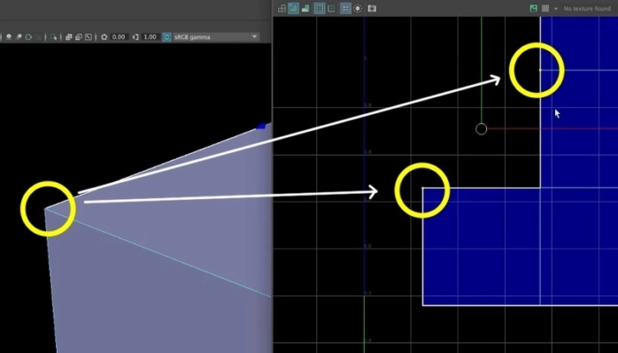
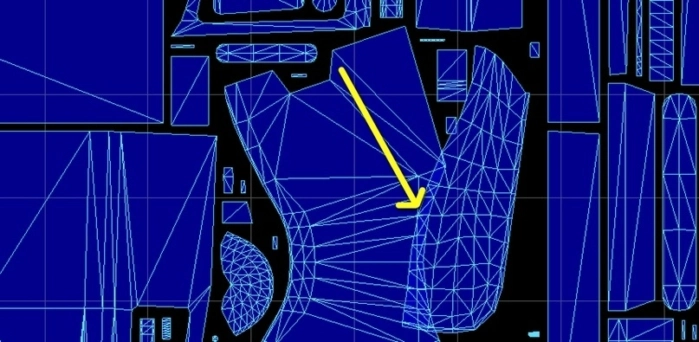
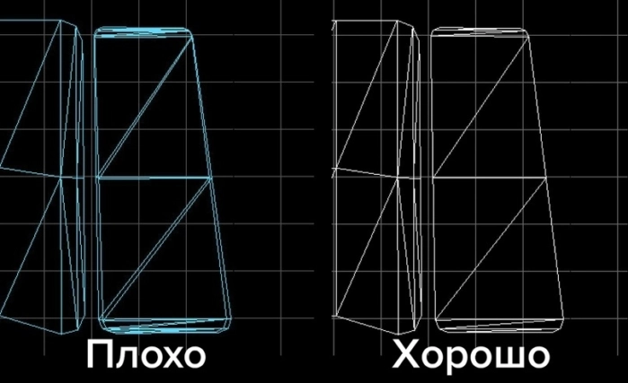

## Что такое развёртка?

3D модель, по определению, сделана из объемных форм.

На любой объект в редакторе можно положить материал, выбрать его цвет и настроить блик. Но положить текстуры на 3D объекты нельзя до тех пор, пока мы не сделаем развёртку. Программа просто не знает как накладывать плоскую текстуру на геометрию.

> Развёртка переносит объёмные формы на плоскость для того, чтобы на них можно было положить текстуры.

В оригами мы делаем из плоского листа бумаги объемный объект.Развёртка делает то же самое, но наоборот — из объемного делает плоское.

Развёртка для видеоигр всегда делается из лоуполи модели

### С чего начинается работа с развёрткой?

В любом 3D редакторе есть инструментарий для работы с UV.

Базового функционала той же Maya хватит, чтобы сделать развёртку даже для очень сложной модели. Но для удобства и редких фишек (например, отрисовка паддинга) иногда используют отдельные программы, созданные исключительно для работы с UV.

Как мы видим на картинке, у куба есть 8 точек и 6 квадратных полигонов. Теперь посмотрим на развёртку, и увидим, что на развёртке тоже 6 квадратов.

Но количество точек на UV больше, чем на самой модели — на развёртке их целых 14. Чтобы понять, откуда они появились, выделим на кубе одну точку, и увидим, что на развёртке выделится сразу несколько точек.

В общем, если на самой модели мы видим одну точку, то на UV при её выделении может появиться сразу несколько точек и каждая из них будет принадлежать полигону, который с ней связан.

Главное сейчас, чтобы вы поняли — что каждый полигон имеет своё место на UV как плоский объект, чтобы программа знала как класть текстуру на геометрию.

### Как UV влияет на поведение текстур

Давайте для примера возьмём кузов от нашего грузовичка.Наложим на него текстуру дерева.

Первым делом, давай сделаем авторазвёртку:

выделим на модели одну из дощечек и перенесём на UV вправо:

**[ Свойство 1 ] Изменяешь положение объекта на UV — изменяешь положение текстуры.**

Кстати, все объекты на UV называются UV шеллы (UV shell).

**[ Свойство 2 ] Так вот, поворачивая шеллы, ты поворачиваешь текстуру на геометрии**

**[ Свойство 3 ] Изменяя размер на UV, ты меняешь размер текстуры на модели.**

## Два вида мапинга

Без теории не обойтись.Когда мы разворачиваем объекты на UV, есть 2 пути:

1. **Сделать уникальный мапинг**.

2. **Сделать тайловый мапинг**.

Прежде чем разбираться с каждым из них по отдельности, обратим внимание на следующее: на UV пространстве много квадратов. На самом деле, они бесконечны.

Но нас особенно интересует именно первый квадрат на UV, который находится от 0 до 1. Имменно на него накладывается текстура, а на всех остальных квадратах текстура просто повторяется

Если мы разворачиваем модель на UV так, что все объекты находятся в первом квадрате и не выходят за его пределы, это называется **уникальным мапингом**.

Делая hard surface или персонажей для игры, тебе нужно делать именно **уникальный мапинг**.

А для объектов окружения, ландшафтов и зданий часто используется **тайловый мапинг**, хотя там тоже не всё так просто.

### Уникальный мапинг

Как мы помним, один материал имеет всего лишь одну единственную текстуру. И она полностью растягивается на первый квадрат UV.

Теперь представим, что мы хотим замапить наш грузовичок. У него есть текстура с деревом для кузова и текстура с крашеным металлом для кабины (хотя на самом деле их гораздо больше).

В принципе, мы можем не заморачиваться. И сделать 2 материала. Один под дерево, другой под крашеный металл. И уже мапить объекты на эти 2 материала.

Но есть нюанс. Каждый новый материал — это лишний вызов отрисовки (draw call), который нагружает игровой движок.

Поэтому, вместо того, чтобы плодить кучу лишних материалов, мы делаем всего один материал. Сначала мы разворачиваем все объекты на UV, потом кидаем в фотошоп или Substance Painter и красим эти элементы по отдельности.

> Кстати, на важные объекты для больших современных игр ты можешь добавлять по 3-5 материалов.

На выходе мы получаем одну единственную квадратную текстуру, сделанную специально для нашей модели.

Это и называется уникальным мапингом. Это технология, которая заключается в следующем:

— Мы мапим все объекты на UV только в первый его квадрат. Ни один из шеллов не выходит за его пределы, и шеллы не пересекаются (кроме оверлапов).

— Объекты покрашены по-разному (кузов деревянный, кабина из крашеного металла). Причём это не повторяющиеся, а уникальные текстуры.

— Но на выходе мы имеем одну единственную текстуру (не считая карты нормали, рафнеса и металнеса) и один материал, тем самым экономим ресурсы игрового движка.

### Тайловый мапинг

Как мы уже знаем, квадраты на UV бесконечны. Это значит, что текстура, которую ты положил в первый квадрат будет повторяться бесконечное количество раз. Это бесконечное повторение текстур называется тайлом.

Тайловый мапинг очень часто используется для развёртки зданий, предметов окружения и ландшафтов.

Представим, что мы хотим сделать развёртку этого дома:

Сначала мы создаём материалы с бесшовными текстурами.Потом кладём их на геометрию с помощью авторазвёртки (box maping).

И так делаем для каждого из объектов. Для стены дома — один материал с кирпичной кладкой. Для прилавка — другой материал с текстурой дерева. И так далее.

Ещё один момент — при тайловом мапинге сами UV шеллы могут выходить за пределы первого квадрата UV. Это нормально.

Зачем это нужно? Представь, что у тебя есть бесшовная текстура с кирпичом. Если развёртка всех стен будет в первом квадрате, то кирпичи будут слишком крупными.

Так как текстура с первого квадрата бесконечно повторяется, а у текстуры нет швов — мы просто меняем размер шеллов на UV и подбираем подходящий для нас размер.

В автомапинге не так важно как выглядит UV развёртка. В отличие от уникального мапинга, нет смысла умещать все шеллы внутри первого квадрата и экономить пространство на UV. Главное, чтобы текстуры выглядели аккуратно и без потягов.

Вот так выглядит дом после развёртки

вот текстуры для тайлового маппинга ([текстуры](https://polyhaven.com/textures/floor))

### - Оверлапы сэкономят пространство на UV

Если на нашей модели есть одинаковые элементы, например, болты на обшивке, то на UV их можно размапить на один и тот же UV shell. Просто посмотрим видео, там всё рассказано:

[видео](https://www.youtube.com/watch?v=PQsSzpm61sY&ab_channel=XYZ)

### - Слишком много свободного места на UV пространстве

​Здесь слишком много свободного пространства на UV. Нужно увеличить размер всех шеллов и перепаковать их, чтобы они полностью заняли первый квадрат. Тогда будет выше тексель и текстура будет более детализированной

### - Объекты на UV пересекаются

Никогда не пересекаем UV шеллы. Это приведёт к артефактам на текстурах.

**Исключения из этого правила — оверлапы**.

### - Кривые оверлапы

Когда объекты не идеально лежат друг на друге, могут появиться швы или некрасивые артефакты на текстурах.

## Советы по правильной работе с UV

- Обрезай сложные формы
- Нельзя мапить объекты на UV вплотную друг к другу

- Отрезай все острые углы и углы под 90 градусов
